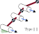

# A library of openchain linkages

This repository describes the dynamic equations for a family of two
and three joint serial chain (mostly robot) linkages. A defining
criteria is that successive joints should be either parallel,
perpendicular or interesct with the previous joint. With this restriction a total of 9 sequential chains and 6 branched chanins can be defined that have 3 joints.
There are only three unbranched chains with 2 joints.

This repository seeks to express these 18 sets of equations in a form that can be used as a start point for dynamic modelling or for comparison with more complex linkages by confirming that a more complex structure reduces to one of these forms.

[A publication is in review with further details]

# Markdown test
Whose mind is full of indices and surds

$$ x^2+7x+53=\frac{11}3$$

| a | b |
|:- | :-|
| c | d |

<!-- need to leave a clear line -->

$$ 
\vec{x}=\begin{bmatrix}1 & 0\end{bmatrix}
$$

## Figures

direct 

url

## links

[UKAEA](https://race.ukaea.uk)

[TL](https://github.com/LinkageDynamics/open-chain/blob/main/threelink/README.md)
